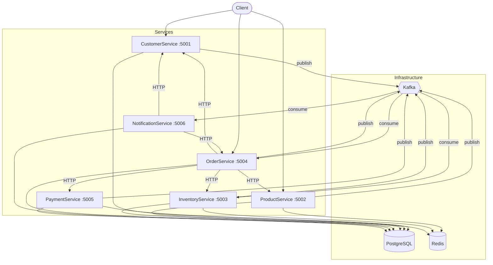
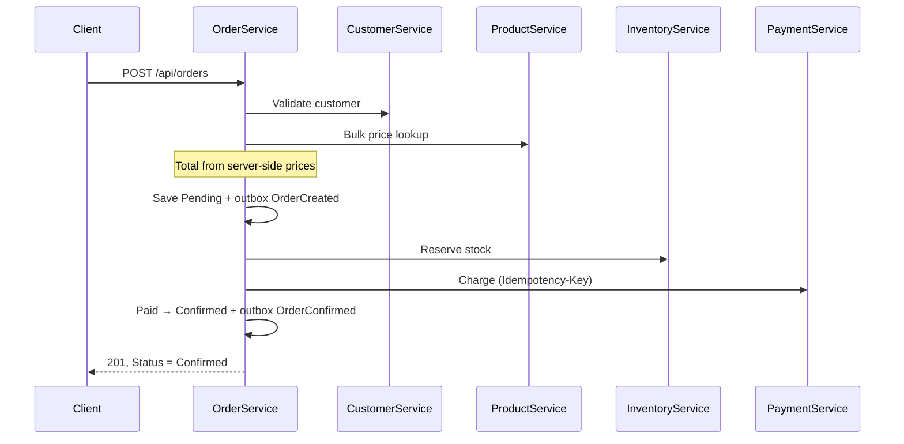

# E-Commerce Microservices

A production-shaped .NET 10 backend: six services, event-driven where it should be,
synchronous where the customer is waiting, with the failure paths built rather than
implied.

Written to be *read*. Every non-obvious decision carries its reasoning in a comment next
to the code, and the documentation explains trade-offs rather than restating what the
code already says.

---

## Contents

1. [Overview](#overview) · 2. [Architecture](#architecture) · 3. [Services](#service-responsibilities)
4. [Communication](#service-communication) · 5. [Databases](#database-ownership) · 6. [Events](#kafka-event-flow)
7. [Order flow](#order-creation-flow) · 8. [Compensation](#failure-and-compensation)
9. [Outbox](#outbox-pattern) · 10. [Idempotency](#idempotency) · 11. [Redis](#redis-usage)
12. [Resilience](#resilience-strategy) · 13. [Observability](#observability) · 14. [Security](#security)
15. [Local development](#local-development) · 16. [Docker](#docker-commands) · 17. [Testing](#testing)

---

## Overview

| | |
|---|---|
| Runtime | .NET 10 / C# 13 |
| API | ASP.NET Core, controllers, OpenAPI |
| Data | PostgreSQL 17 + EF Core, one database per service |
| Messaging | Kafka (KRaft, no ZooKeeper) |
| Cache / locks | Redis |
| Observability | Serilog structured logging, OpenTelemetry traces and metrics |
| Validation | FluentValidation |
| Tests | xUnit — 123 unit tests |

**Stated up front:** the payment provider is a simulator. It has no network calls, no
credentials and no PCI surface, and it declines a configurable fraction of charges on
purpose so the compensation path is exercised rather than assumed.

## Architecture



Detail: [docs/architecture.md](docs/architecture.md)

## Service responsibilities

| Service | Port | Owns | Publishes | Consumes |
|---|---|---|---|---|
| **CustomerService** | 5001 | Identity, contact details, dev tokens | `customer.*` | — |
| **ProductService** | 5002 | Catalogue, pricing, SKUs | `product.*` | — |
| **InventoryService** | 5003 | Stock levels, reservations | `inventory.*` | `order.cancelled` |
| **OrderService** | 5004 | Order lifecycle, saga orchestration | `order.*` | `payment.succeeded`, `payment.failed` |
| **PaymentService** | 5005 | Charges, refunds, idempotency | `payment.*` | — |
| **NotificationService** | 5006 | Email and SMS delivery, history | `notification.*` | `order.*`, `payment.*` |

One boundary is worth calling out: **PaymentService does not know who the customer is.**
Its events carry an order id. NotificationService resolves the customer through
OrderService when it needs to, keeping card-adjacent code away from personal data.

## Service communication

The rule is about who is waiting.

**HTTP when the caller cannot proceed without an answer** — order placement validates the
customer, prices the basket, reserves stock and charges the card synchronously, because
the customer is watching a spinner.

**Kafka when the caller does not need to know** — an order confirmation must not fail
because a mail server is down.

| From | To | Transport | Why |
|---|---|---|---|
| OrderService | CustomerService | HTTP | Cannot price an order for a suspended customer |
| OrderService | ProductService | HTTP | Needs prices now, in one bulk call |
| OrderService | InventoryService | HTTP | Customer must hear about short stock immediately |
| OrderService | PaymentService | HTTP | The answer is the point |
| OrderService | InventoryService | Kafka | Cancellation compensation — nobody waiting |
| Anything | NotificationService | Kafka | Mail must never block a checkout |

## Database ownership

Six databases on one instance. One instance because this is a dev environment; six
databases because a shared schema makes it far too easy to join across a boundary that is
meant to be a network call.

```
customer_db · product_db · inventory_db · order_db · payment_db · notification_db
```

No service opens a connection to another's database. Every one also carries its own
`outbox_messages` and `processed_messages` — both only work if they commit in the same
transaction as the data they protect.

## Kafka event flow

Six topics, one per publishing service, plus a `.dlq` companion each. The partition key is
always the aggregate id, so events for one order stay ordered relative to each other.

Full catalogue and envelope format: [docs/events.md](docs/events.md)

## Order creation flow



`CreateOrderRequest` carries product ids and quantities — **not prices.** A
client-supplied price is an invitation to buy the catalogue for a cent.

Step-by-step with every failure branch: [docs/order-flow.md](docs/order-flow.md)

## Failure and compensation

No distributed transactions. Each step commits locally; each step that can fail after an
earlier one took effect has a compensating action.

| Failure | Compensation |
|---|---|
| Stock short | Cancel the order. Nothing was reserved. |
| Payment declined | Release stock (synchronously **and** via `OrderCancelled`), mark `PaymentFailed` |
| PaymentService unreachable | **Do not cancel.** Outcome unknown — leave the order for the payment-event consumer to resolve. |
| Customer cancels | Release stock, publish `OrderCancelled` |

Stock is released along two paths on purpose: the synchronous call may fail, and the event
is the guarantee. `ReleaseAsync` is idempotent because it works from held reservation
rows, so the second release finds nothing to do.

## Outbox pattern

Saving an order and publishing `OrderCreated` are two systems, and no ordering of the two
writes is safe. The Outbox turns them into one: the order row and the event row commit in
a single local transaction, and a background worker drains the outbox to Kafka.

- Claimed with `FOR UPDATE SKIP LOCKED`, so replicas do not double-publish
- Failed rows retry; after 10 attempts they are parked as dead-lettered
- Delivery becomes at-least-once — which is why consumers deduplicate

Detail: [docs/outbox.md](docs/outbox.md)

## Idempotency

Two distinct problems:

**HTTP retries** (payments) — caller-supplied `Idempotency-Key`, three layers: a lookup, a
Redis reservation, and a unique index on `payments.idempotency_key`. The index is the real
guarantee; the other two make the common case fast.

**Kafka redelivery** — `processed_messages (event_id, consumer_name)` in each service's own
database, committed with the side effect it guards.

Detail: [docs/idempotency.md](docs/idempotency.md)

## Redis usage

Three uses, each justified. Redis is never a hard dependency — every cache read swallows
failures and falls through to the source.

| Where | What | Why it earns its place |
|---|---|---|
| ProductService | Read-through product cache, 10min TTL | Called for every line of every order; catalogue changes a few times a day; a stale read is harmless |
| InventoryService | Distributed lock per product | Keeps a flash sale from piling hundreds of connections onto one row. **Not** the correctness guarantee — the row lock is. |
| PaymentService | Idempotency key reservations, 24h TTL | High volume, short window, and the DB index backs it up |

**Deliberately not cached:** inventory levels (correctness depends on freshness), order
state (changes constantly, read once), customers (low traffic).

Writes evict rather than update — deleting is always correct, whereas writing the new
value is still stale if another update committed in between.

## Resilience strategy

**Retry what the environment broke; never retry what you broke.** A 500 might succeed next
time; a 400 will be a 400 forever.

Outbound HTTP gets four layers: total timeout (10s) → retry (3, exponential + jitter) →
circuit breaker (50% over 30s) → per-attempt timeout (3s).

Kafka consumers get bounded retry with the partition paused during backoff — otherwise the
broker assumes the consumer died and rebalances mid-retry.

Detail, including what was deliberately left out: [docs/resilience.md](docs/resilience.md)

## Observability

**Structured logging** via Serilog. Every line carries the service name and correlation id.

**Correlation ids** created at the HTTP edge, forwarded on outgoing calls, and carried in
the Kafka envelope. One id ties a failed order across all six services.

**Tracing and metrics** via OpenTelemetry with ASP.NET Core and HttpClient instrumentation,
exported over OTLP when `OTEL_EXPORTER_OTLP_ENDPOINT` is set. Health probes are filtered
out so they do not drown the traces that matter.

**Never logged:** passwords, tokens, card data. Email addresses and phone numbers are
masked in notification logs (`a***@example.com`, `***4567`).

## Security

JWT bearer authentication with three roles and four policies:

| Policy | Roles | Guards |
|---|---|---|
| `ManageCatalog` | Admin | Product and stock writes |
| `ViewAnyCustomer` | Admin, Support | Customer and order listings |
| `PlaceOrders` | Admin, Customer, Support | Creating and cancelling orders |
| `IssueRefunds` | Admin, Support | Refunds — deliberately not Customer |

Tokens are issued by a development endpoint on CustomerService that is **only registered
outside Production**. There is no user store and no password check; this exists so the API
can be exercised without deploying an identity provider.

Replacing it with Keycloak means pointing the bearer options at a JWKS URL and deleting
`TokenIssuer`. Nothing that consumes a token changes.

Secrets come from environment variables. `Jwt:SigningKey` has no default — the service
refuses to start without one.

## Local development

### Prerequisites

.NET 10 SDK, Docker (or Colima), `dotnet-ef` for migrations.

### Run everything

```bash
cp .env.example .env      # then edit JWT_SIGNING_KEY
docker compose up -d --build
docker compose ps         # wait for healthy
```

Swagger for each service: `http://localhost:500{1..6}/swagger`

### Run one service against dockerised infrastructure

```bash
docker compose up -d postgres redis kafka
dotnet run --project src/Services/OrderService
```

Migrations run automatically at startup.

### Try the full flow

```bash
# 1. Token
TOKEN=$(curl -s -X POST http://localhost:5001/api/auth/token \
  -H 'Content-Type: application/json' \
  -d '{"email":"admin@example.com","role":"Admin"}' | jq -r .accessToken)

# 2. Customer
CUSTOMER=$(curl -s -X POST http://localhost:5001/api/customers \
  -H "Authorization: Bearer $TOKEN" -H 'Content-Type: application/json' \
  -d '{"firstName":"Ada","lastName":"Lovelace","email":"ada@example.com","phone":"+441234567890"}' | jq -r .id)

# 3. Product, then activate it
PRODUCT=$(curl -s -X POST http://localhost:5002/api/products \
  -H "Authorization: Bearer $TOKEN" -H 'Content-Type: application/json' \
  -d '{"name":"Analytical Engine","description":"Mechanical","sku":"AE-001","price":1999.99,"currency":"EUR","category":"Machines"}' | jq -r .id)

curl -s -X POST "http://localhost:5002/api/products/$PRODUCT/activate" -H "Authorization: Bearer $TOKEN"

# 4. Stock
curl -s -X POST "http://localhost:5003/api/inventory/$PRODUCT/increase" \
  -H "Authorization: Bearer $TOKEN" -H 'Content-Type: application/json' \
  -d '{"quantity":10,"reason":"initial"}'

# 5. Order — watch the saga in the logs
curl -s -X POST http://localhost:5004/api/orders \
  -H "Authorization: Bearer $TOKEN" -H 'Content-Type: application/json' \
  -d "{\"customerId\":\"$CUSTOMER\",\"currency\":\"EUR\",\"lines\":[{\"productId\":\"$PRODUCT\",\"quantity\":2}]}" | jq

# 6. Notifications that resulted
curl -s "http://localhost:5006/api/notifications?customerId=$CUSTOMER" \
  -H "Authorization: Bearer $TOKEN" | jq
```

With the default 15% decline rate, roughly one order in seven takes the compensation path.
Set `PAYMENT_FAILURE_RATE=0` in `.env` for a deterministic happy path, or `1` to see the
failure flow every time.

## Docker commands

```bash
docker compose up -d --build          # build and start everything
docker compose ps                     # health status
docker compose logs -f order-service  # follow one service
docker compose down                   # stop
docker compose down -v                # stop and delete all data

docker compose build order-service    # rebuild one image
docker compose restart order-service
```

Kafka:

```bash
docker exec ecommerce-kafka /opt/kafka/bin/kafka-topics.sh \
  --bootstrap-server localhost:9092 --list

docker exec ecommerce-kafka /opt/kafka/bin/kafka-console-consumer.sh \
  --bootstrap-server localhost:9092 --topic order-events --from-beginning
```

Postgres:

```bash
docker exec -it ecommerce-postgres psql -U postgres -d order_db

# Outbox backlog
docker exec ecommerce-postgres psql -U postgres -d order_db -c \
  "SELECT event_type, count(*) FROM outbox_messages WHERE processed_at IS NULL GROUP BY 1;"
```

## Testing

```bash
dotnet test                                          # all 123
dotnet test tests/OrderService.Tests                 # one project
dotnet test --filter FullyQualifiedName~StateMachine # one area
```

| Project | Tests | Covers |
|---|---|---|
| OrderService.Tests | 36 | Totals, decimal rounding, state machine, validation |
| CustomerService.Tests | 21 | Normalisation, soft delete, email/phone validation |
| ProductService.Tests | 20 | SKU normalisation, status rules, price precision |
| InventoryService.Tests | 20 | Reserve, release, commit, negative-stock prevention |
| PaymentService.Tests | 18 | Status transitions, refund rules, idempotency key |
| NotificationService.Tests | 8 | Retry backoff, abandonment, error truncation |

The tests concentrate on business rules rather than plumbing: the ones worth writing are
those that would let a real bug ship — overselling stock, a cent lost to rounding, an
order confirmed without payment.

## Migrations

```bash
dotnet ef migrations add <Name> \
  --project src/Services/OrderService \
  --context OrderDbContext \
  --output-dir Infrastructure/Migrations
```

Applied automatically on startup. Acceptable because each service owns its schema outright
and compose runs a single replica; a multi-replica deployment would run migrations as a
separate job so two instances cannot race the same DDL.

## Repository layout

```
src/
  BuildingBlocks/     Core · Messaging · Persistence · Caching · Web
  Services/           Customer · Product · Inventory · Order · Payment · Notification
tests/                one project per service
docs/                 architecture · order-flow · events · resilience · outbox · idempotency
docker-compose.yml
Dockerfile            one file, parameterised by SERVICE build arg
```

### A note on the filesystem

This repository lives on an exFAT volume, which has no native extended attributes, so
macOS writes an AppleDouble sidecar (`._Foo.cs`) beside every file. Two consequences,
both handled:

- `Directory.Build.props` sets `DefaultItemExcludes` to keep those sidecars out of the
  C# compile glob. (A `<Compile Remove>` would not work — it runs before the SDK expands
  its default globs.)
- Docker's build context reader trips over them. `find . -name '._*' -delete` before a
  build, or work on an APFS volume.
